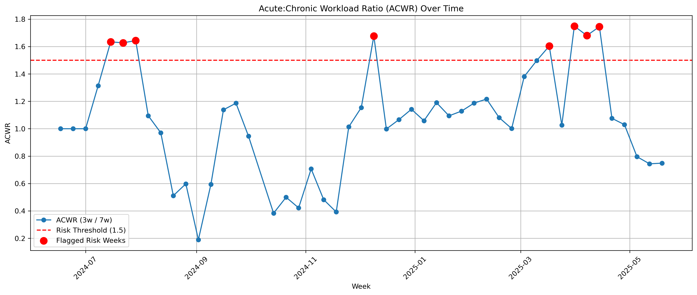

# 🏃‍♀️ Triathlon Data Science: Predicting Fitness Fatigue & Overtraining Risk

This project explores my personal triathlon training data from Garmin, with the goal of detecting signs of overtraining using real physiological signals like heart rate, distance, and aerobic training effect. 

Using weekly summaries, rolling averages, and sport science concepts like the Acute:Chronic Workload Ratio (ACWR), I created a system to flag weeks of potential overtraining based on my actual running, cycling, and swimming patterns.

---

## 🎯 Objectives

- Explore and visualize weekly training load by sport  
- Engineer features like 3-week and 7-week rolling metrics  
- Calculate the ACWR to estimate load spikes  
- Flag risky weeks and visualize fatigue risk clearly  
- Turn personal fitness data into a portfolio-ready ML-style case

---

## 📊 Sample Visualization: ACWR Over Time

This plot shows the rolling ratio of short-term vs. long-term training load. Red dots highlight weeks with a high risk of overtraining (ACWR > 1.5). The spike during **March 31, 2025** reflects a Mallorca triathlon camp where I cycled over 400km in one week.

---

## 🔍 Key Features Engineered

- **Weekly distance per sport (Running, Cycling, Swimming)**  
- **3-week rolling sum** → acute load  
- **7-week rolling average** → chronic fitness  
- **ACWR (acute / chronic)**  
- **Risk flag** for ACWR > 1.5  

---

## 🧠 Insights & Learnings

- Personal data can be structured like a real-world analytics case  
- Load spikes are clearly visible and often correlate with events (like training camps)  
- Feature engineering can be guided by real sport science practices  
- The logic used here could be extended to real-time monitoring or mobile fitness dashboards

---

## 💡 Next Steps

- Add subjective fatigue scores or sleep data  
- Train a logistic regression model using the `Risk_Flag`  
- Deploy as a Streamlit dashboard  
- Try cluster analysis to detect “training types”

---

## 🙋‍♀️ About Me

I’m Seval, a data analyst and triathlete based in Amsterdam. This project combines two of my passions: data-driven insight and endurance sports. Connect with me on [LinkedIn](https://www.linkedin.com/in/sevalbozkurt) if you’d like to collaborate!
